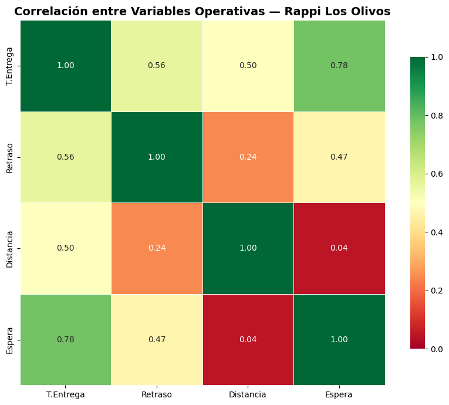
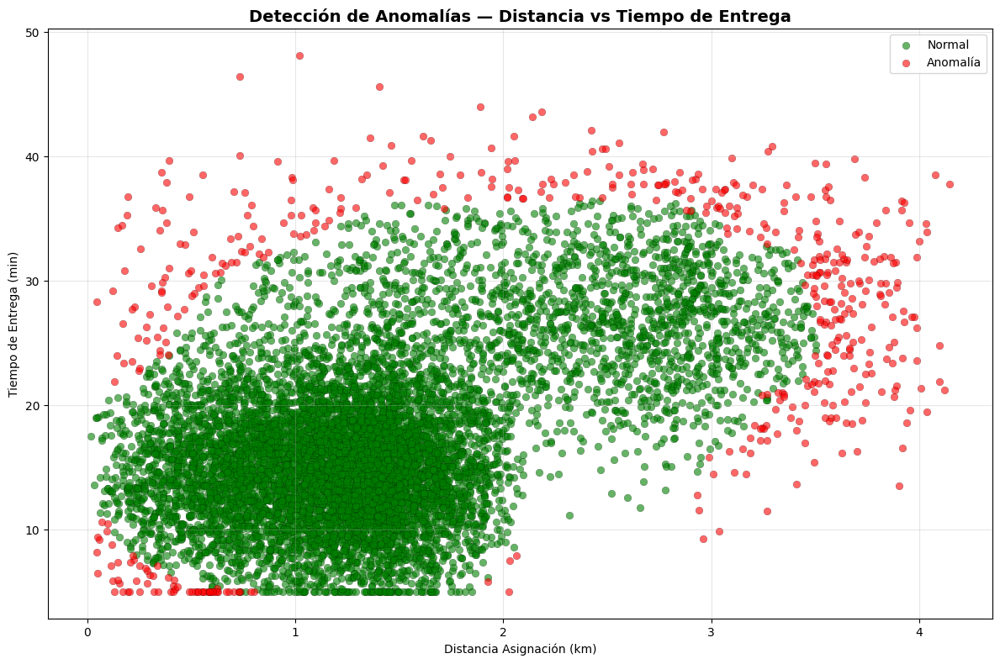
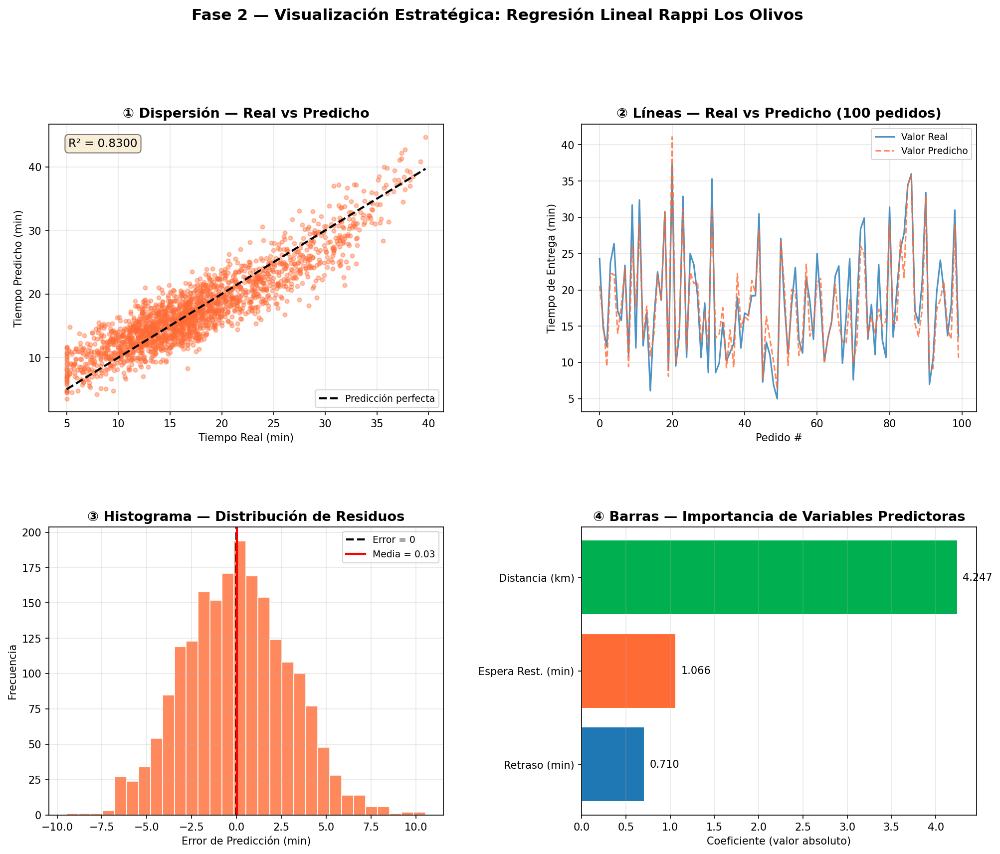

🚀 Rappi Delivery Analytics | SLA Prediction & Business Intelligence

End-to-end Data Analytics project focused on delivery performance analysis, SLA prediction, Business Intelligence, and Machine Learning for Rappi's delivery operations in Los Olivos, Peru.

📌 Project Overview

Last-mile delivery companies must maintain high Service Level Agreement (SLA) compliance to ensure customer satisfaction and operational efficiency.

This project analyzes over 10,000 simulated delivery records to identify the main factors affecting delivery performance and build a predictive system capable of detecting late deliveries before they occur.

The complete solution includes:

📊 Interactive Power BI Dashboard
🗄️ Data Warehouse (Snowflake Schema)
🔄 ETL Pipeline (Bronze → Silver → Gold)
🤖 Machine Learning Models
⚡ FastAPI Prediction API
🌐 React Dashboard
📸 Dashboard Preview
Executive Dashboard

  

🏗️ Solution Architecture

  

Data Flow
Raw Data
      │
      ▼
 Bronze Layer
      │
      ▼
 Silver Layer
      │
      ▼
 Gold Layer
      │
      ▼
 Data Warehouse
      │
      ├── Power BI Dashboard
      ├── Machine Learning
      ├── FastAPI
      └── React Dashboard
🎯 Business Problem

The delivery service presented an SLA compliance of 92.42%, meaning approximately 7.58% of deliveries exceeded the expected delivery time.

Business questions:

Why are deliveries arriving late?
Which operational variables have the greatest impact?
Can late deliveries be predicted before they happen?
What actions would improve SLA compliance?
📊 Exploratory Data Analysis
Correlation Analysis

Restaurant waiting time proved to be the strongest predictor of delivery delays.

Variable	Correlation
Restaurant Waiting Time	0.78
Driver Distance	0.50

  

SLA Compliance by Hour

Performance decreases significantly during lunch and dinner peak hours.

  

Anomaly Detection

Isolation Forest detected approximately 5% of deliveries with abnormal behavior.

  

🤖 Machine Learning

Four different algorithms were evaluated.

Model	Objective
Logistic Regression	Classification
Random Forest	Classification
XGBoost	Classification
Linear Regression	Regression
Best Model
XGBoost

Accuracy

92.85%

  

Regression Performance

Real vs Predicted Delivery Time

  

💡 Business Insights

The analysis revealed that:

Restaurant preparation time has a greater impact on delivery delays than courier distance.
Lunch and dinner represent the highest operational risk periods.
A small percentage of deliveries exhibit abnormal operational behavior.
Machine Learning enables proactive SLA monitoring before delays occur.
📈 Business Recommendations
Restaurant Operations
Notify restaurants before courier arrival.
Reduce food preparation waiting times.

Expected impact

2–3 minutes less per delivery.
Fleet Management

Increase courier availability during:

12:00 PM – 2:00 PM
7:00 PM – 9:00 PM

Expected SLA:

85%+

Predictive Analytics

Deploy the XGBoost model into production.

Automatically identify deliveries with a high probability of SLA failure and reassign drivers when necessary.

🛠️ Technology Stack
Data Engineering
Python
MySQL
ETL Pipeline
Snowflake Schema
Data Analysis
Pandas
NumPy
Machine Learning
Scikit-Learn
XGBoost
Isolation Forest
K-Means
SMOTE
Visualization
Power BI
Matplotlib
Seaborn
Backend
FastAPI
Frontend
React
📁 Project Structure
Rappi-Delivery-Analytics
│
├── backend
├── frontend
├── notebooks
├── sql
├── dataset
├── imagenes
├── README.md
🚀 Quick Start
Clone repository
git clone https://github.com/alextorres04/analisis-datos-rappi-losolivos.git
Database
mysql -u root -p < rappi.sql
Backend
cd backend
uvicorn main:app --reload
Frontend
cd frontend
npm install
npm start
🌐 Application
Service	URL
React Dashboard	http://localhost:3000
FastAPI	http://localhost:8000
Swagger Docs	http://localhost:8000/docs
📌 Skills Demonstrated
Data Cleaning
Exploratory Data Analysis (EDA)
Statistical Analysis
Feature Engineering
Machine Learning
ETL Development
Data Warehousing
Dashboard Development
Business Intelligence
REST API Development
React Integration
👨‍💻 Author

Alexander Torres

Software Engineering Student | Aspiring Data Analyst

GitHub: https://github.com/alextorres04