# 🛵 Datamart Rappi Los Olivos — Análisis de Entregas Last-Mile

> **Construcción de un Datamart para optimizar el proceso del reparto de comida de la empresa Rappi en el distrito de Los Olivos**

[](https://python.org)
[](https://fastapi.tiangolo.com)
[](https://reactjs.org)
[](https://powerbi.microsoft.com)
[](https://mysql.com)
[](LICENSE)

---

## 📋 Tabla de Contenidos

- [Descripción del Proyecto](#-descripción-del-proyecto)
- [Problema de Negocio](#-problema-de-negocio)
- [Resultados Clave](#-resultados-clave)
- [Arquitectura del Sistema](#-arquitectura-del-sistema)
- [Stack Tecnológico](#-stack-tecnológico)
- [Estructura del Proyecto](#-estructura-del-proyecto)
- [Instalación y Ejecución](#-instalación-y-ejecución)
- [Visualizaciones y Análisis](#-visualizaciones-y-análisis)
- [Dashboards Power BI](#-dashboards-power-bi)
- [Modelo Predictivo](#-modelo-predictivo)
- [KPIs Definidos](#-kpis-definidos)
- [Equipo](#-equipo)

---

## 📌 Descripción del Proyecto

Este proyecto construye un **Datamart analítico** para optimizar el proceso de distribución de pedidos de Rappi en el distrito de **Los Olivos, Lima — Perú**, enfocándose en la etapa de **última milla (last-mile delivery)**.

A través de un pipeline de datos completo **(ETL → EDA → ML → BI Dashboard)**, el sistema identifica las causas raíz de los retrasos operativos, predice el cumplimiento del SLA en tiempo real y proporciona un panel de control interactivo para la toma de decisiones.

---

## 🔴 Problema de Negocio

La zona de la **Av. Universitaria en Los Olivos** presenta:

- ❌ Mala asignación de repartidores (se prioriza disponibilidad sobre cercanía)
- ❌ Incumplimiento del SLA en franjas de 12:00–14:00h y 19:00–21:00h
- ❌ Sistemas transaccionales separados (pedidos, GPS, restaurantes) sin integración
- ❌ Ausencia de KPIs operativos para medir el desempeño en tiempo real

---

## 🎯 Resultados Clave

| KPI | Valor Actual | Meta |
|---|---|---|
| ✅ Cumplimiento SLA | **92.42%** | > 90% |
| ⏱️ Tiempo Promedio de Entrega | **17.66 min** | < 30 min |
| 📍 Distancia Promedio de Asignación | **1.43 km** | < 1.5 km |
| 🍽️ Espera en Restaurante | **9.61 min** | < 10 min |
| ⚠️ Retraso Promedio | **3.60 min** | Reducir 15% |

### 🔍 Hallazgo Principal
> La espera en restaurante **(r = 0.78)** tiene mayor impacto en el tiempo de entrega que la distancia de asignación **(r = 0.50)**. Las fallas no son aleatorias: son **estacionales** y ocurren en 2 franjas horarias específicas.

---

## 🏗️ Arquitectura del Sistema

```
┌─────────────────────────────────────────────────────────┐
│                    FUENTES DE DATOS                      │
│         App Rappi · GPS · Restaurantes · Clientes        │
└─────────────────────┬───────────────────────────────────┘
                      │
                      ▼
┌─────────────────────────────────────────────────────────┐
│              MEDALLION ARCHITECTURE (ETL)                │
│                                                          │
│   🥉 Bronze          🥈 Silver          🥇 Gold          │
│   Datos crudos  →  Limpieza/Cálculo  →  Modelo Dim.     │
│   (MySQL)          (Python/Pandas)      (Copo de Nieve)  │
└─────────────────────┬───────────────────────────────────┘
                      │
          ┌───────────┴───────────┐
          ▼                       ▼
┌─────────────────┐   ┌──────────────────────────┐
│   Power BI      │   │   Python ML              │
│   Dashboard     │   │   · Regresión Lineal     │
│   · 2 páginas   │   │   · XGBoost (92.85%)     │
│   · 5 KPIs      │   │   · Isolation Forest     │
│   · Mapa calor  │   │   · K-Means Clustering   │
│                 │   │   · R² = 0.83            │
└─────────────────┘   └──────────────────────────┘
          │                       │
          └───────────┬───────────┘
                      ▼
┌─────────────────────────────────────────────────────────┐
│              PROTOTIPO WEB (FastAPI + React)             │
│         Dashboard interactivo + Predictor SLA            │
└─────────────────────────────────────────────────────────┘
```

## 🗄️ Modelo Dimensional del Datamart

El datamart implementa un **esquema copo de nieve** compuesto por 
1 tabla de hechos central y 11 dimensiones normalizadas.

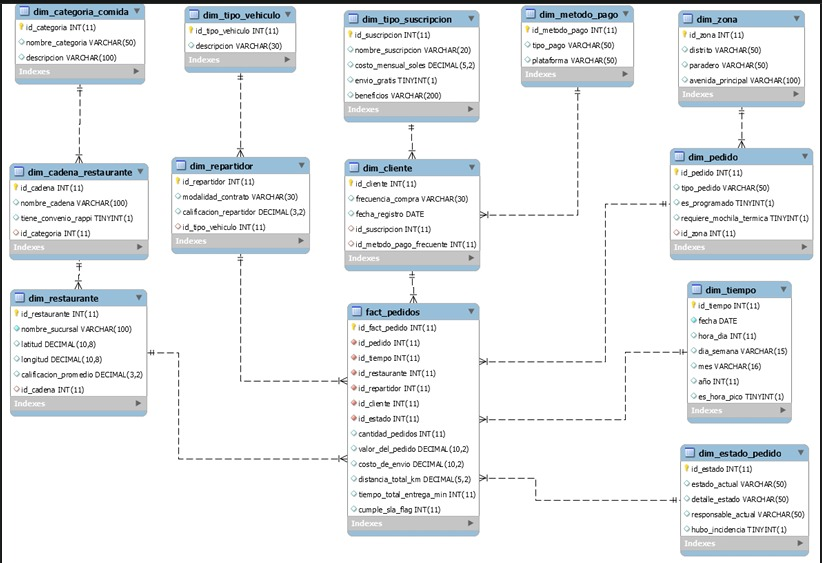

**Tabla de Hechos:** `fact_pedidos` — registra cada pedido con métricas 
de tiempo, distancia, SLA y espera en restaurante.

**Dimensiones principales:** `dim_zona`, `dim_tiempo`, `dim_restaurante`, 
`dim_repartidor`, `dim_cliente`, `dim_estado_pedido` y 5 subdimensiones 
adicionales.

---

## 🛠️ Stack Tecnológico

| Capa | Tecnología | Uso |
|---|---|---|
| **Base de Datos** | MySQL 8.0 | Datamart (12 tablas: 1 fact + 11 dims) |
| **ETL** | Python 3.14 + Pandas | Pipeline Bronze → Silver → Gold |
| **EDA** | Matplotlib + Seaborn + Plotly | Análisis exploratorio (15 visualizaciones) |
| **ML** | Scikit-learn + XGBoost | Regresión, clasificación, clustering y anomalías |
| **BI Dashboard** | Power BI Desktop | Dashboards interactivos |
| **Backend API** | FastAPI + Uvicorn | REST API con predictor SLA en tiempo real |
| **Frontend** | React + Tailwind CSS | Prototipo web interactivo |
| **Control de Versiones** | Git + GitHub | Repositorio del proyecto |

---

## 📁 Estructura del Proyecto

```
PROJECT_RAPPI/
│
├── 📂 analytics/
│   ├── 📂 ETL/
│   │   └── ETL_Rappi_Bronze_Silver_Gold.ipynb      # Pipeline completo
│   ├── 📂 EDA/
│   │   └── EDA_Rappi_Analisis_Exploratorio.ipynb   # Análisis exploratorio
│   └── 📂 ML/
│       ├── ML_analisis_avanzado_rappi.ipynb         # Correlación, anomalías, K-Means
│       ├── ML_Modelo_Predictivo_y_Regresion.ipynb   # Regresión + XGBoost
│       └── ML_Visualizacion_Reporte_Data_Storytelling.ipynb
│
├── 📂 backend/
│   ├── main.py          # FastAPI endpoints
│   ├── database.py      # Conexión MySQL
│   └── ml_model.py      # Modelo predictivo cargado
│
├── 📂 frontend/
│   ├── src/             # Componentes React
│   ├── public/          # Assets públicos
│   └── tailwind.config.js
│
├── 📂 data/
│   ├── gold_fact_pedidos_completo.csv    # Dataset principal Gold
│   ├── gold_dim_tiempo.csv
│   ├── gold_dim_zona.csv
│   ├── gold_dim_restaurante.csv
│   ├── gold_dim_repartidor.csv
│   └── ... (12 archivos Gold en total)
│
├── 📂 imagenes/
│   ├── real_vs_predicho.png              # Regresión lineal
│   ├── correlacion_variables.png         # Matriz de correlación
│   ├── anomalias.png                     # Detección de anomalías
│   ├── cumplimiento_sla.png              # SLA por hora del día
│   ├── eda_kmeans_clusters.png           # Clustering K-Means
│   ├── eda_boxplots.png                  # Distribución de outliers
│   ├── eda_histogramas.png               # Histogramas
│   ├── eda_franja_horaria.png            # Análisis por franja
│   ├── eda_distribucion_sla.png          # Distribución SLA
│   ├── eda_correlacion.png               # Correlación EDA
│   ├── eda_balance_sla.png               # Balance SLA
│   ├── eda_analisis_temporal.png         # Series de tiempo
│   ├── eda_analisis_semanal.png          # Análisis semanal
│   ├── eda_distribuciones.png            # Distribuciones generales
│   └── fase2_visualizacion.png           # Visualización fase 2
│
├── 📂 dashboard_powerbi/
│   └── rappi_dashboard.pbix              # Dashboard Power BI
│
└── 📂 docs/
    ├── datamart.png                      # Diagrama del modelo dimensional
    └── Prácticas_Éticas_and_...          # Consideraciones éticas
```

---

## 🚀 Instalación y Ejecución

### Prerrequisitos
- Python 3.14+
- Node.js 18+
- MySQL 8.0+
- Power BI Desktop (opcional)

### 1. Clonar el repositorio
```bash
git clone https://github.com/alextorres04/analisis-datos-rappi-losolivos.git
cd analisis-datos-rappi-losolivos
```

### 2. Configurar la base de datos
```bash
# Importar el esquema MySQL
mysql -u root -p < docs/rappi.sql
```

### 3. Instalar dependencias Python
```bash
pip install -r requirements.txt
```

### 4. Ejecutar el ETL
```bash
cd analytics/ETL
jupyter notebook ETL_Rappi_Bronze_Silver_Gold.ipynb
```

### 5. Correr el Backend
```bash
cd backend
uvicorn main:app --reload
# API disponible en:     http://127.0.0.1:8000
# Documentación Swagger: http://127.0.0.1:8000/docs
```

### 6. Correr el Frontend
```bash
cd frontend
npm install
npm start
# App disponible en: http://localhost:3000
```

---

## 📊 Visualizaciones y Análisis

### Regresión Lineal — Real vs Predicho (R² = 0.83)
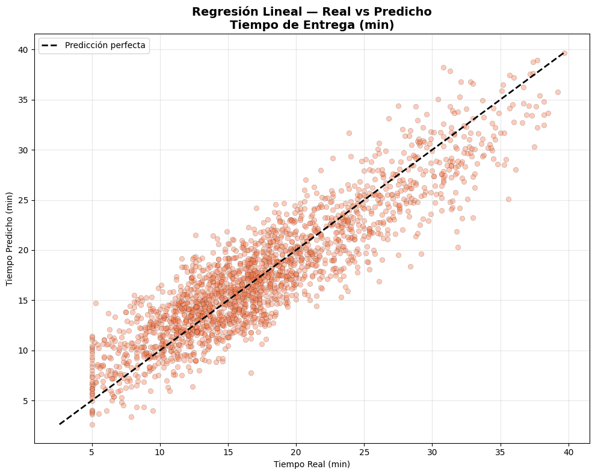

### Correlación entre Variables Operativas


> **Hallazgo clave:** La espera en restaurante (r=0.78) impacta más el tiempo de entrega que la distancia (r=0.50)

### Cumplimiento SLA por Hora del Día
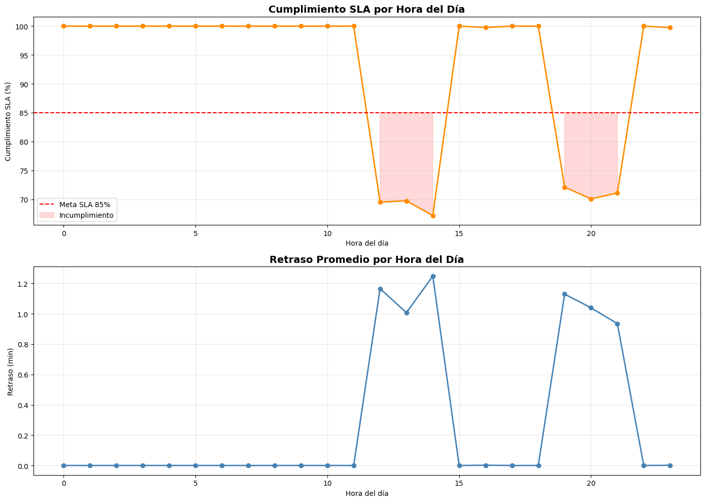

> **Caídas críticas** detectadas en franjas 12:00–14:00h y 19:00–21:00h

### Detección de Anomalías — Isolation Forest


### Clustering K-Means — Perfiles de Riesgo
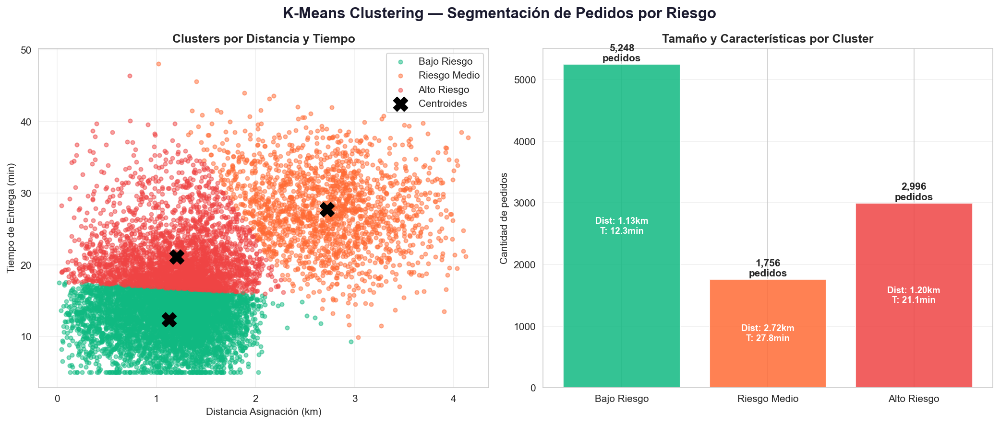

### Distribución de Outliers — Boxplots
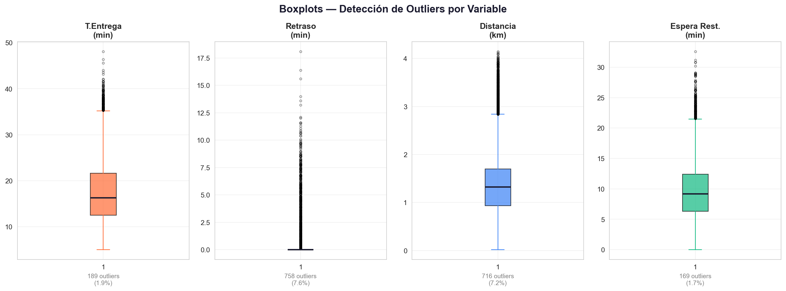

### Análisis por Franja Horaria
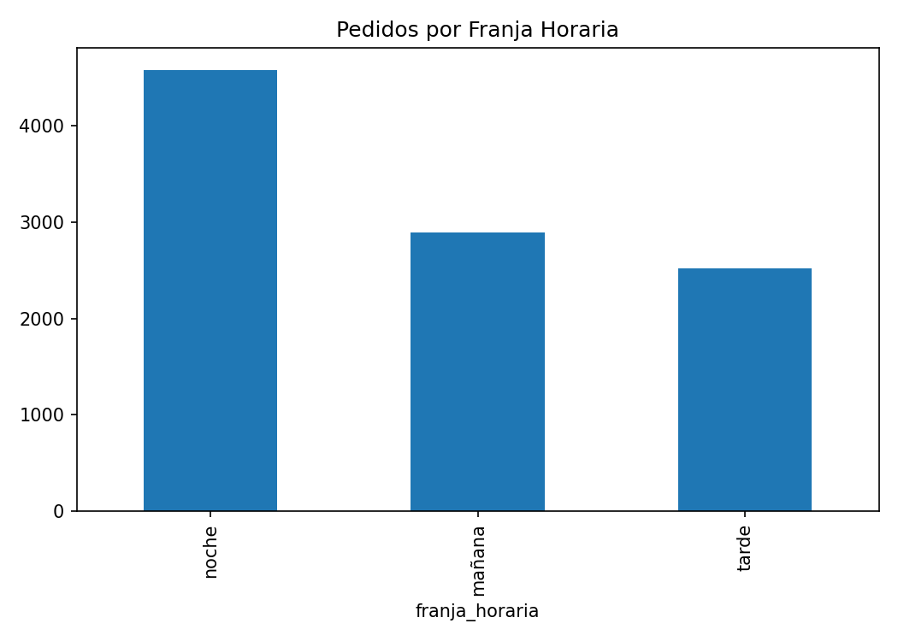

### Distribución del SLA
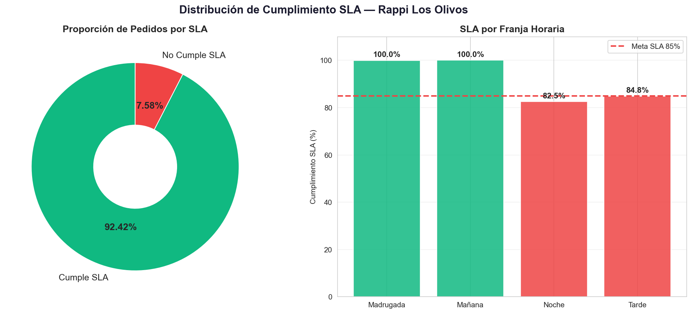

---

## 📈 Dashboards Power BI

### Página 1 — Dashboard Operativo de Entregas
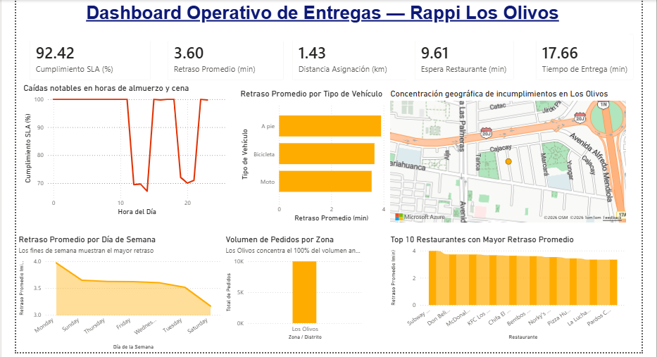

- 5 KPIs en tiempo real (SLA, Retraso, Distancia, Espera, Tiempo)
- Cumplimiento SLA por hora del día (caídas en 12-14h y 19-21h)
- Top 10 restaurantes con mayor retraso promedio
- Mapa de calor geográfico por zona en Los Olivos
- Retraso promedio por tipo de vehículo y día de semana

---

### Página 2 — Flujo del Pedido
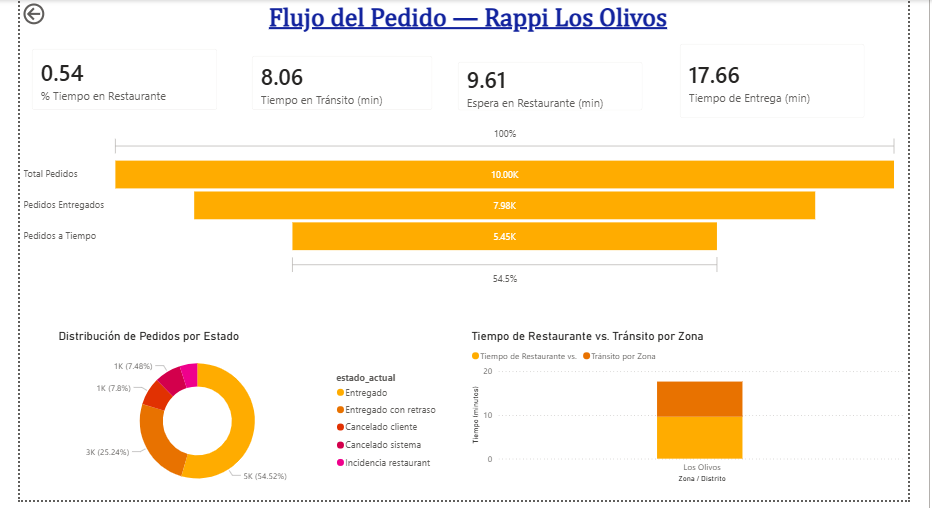

- Embudo de conversión: Total → Entregados → A Tiempo **(54.5%)**
- Distribución de 5 estados de pedido (dona)
- Tiempo en restaurante vs. tiempo en tránsito por zona
- 4 KPIs: % Tiempo en Restaurante, Tránsito, Espera y Entrega

---

### Página 3 — Detalle por Restaurante y Repartidor
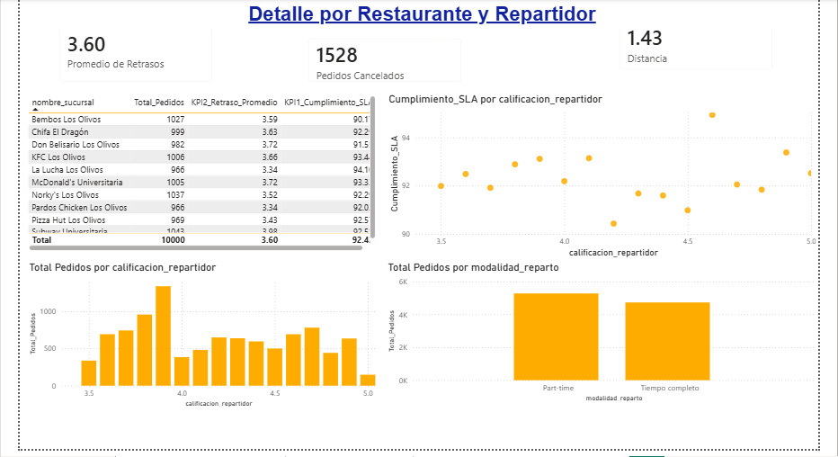

- Tabla de detalle por restaurante con SLA y retraso individual
- Calificación de repartidores vs. cumplimiento SLA
- Pedidos por modalidad de contrato del repartidor
- Dispersión: calificación vs. eficiencia operativa

---

### Prototipo Web — React + FastAPI
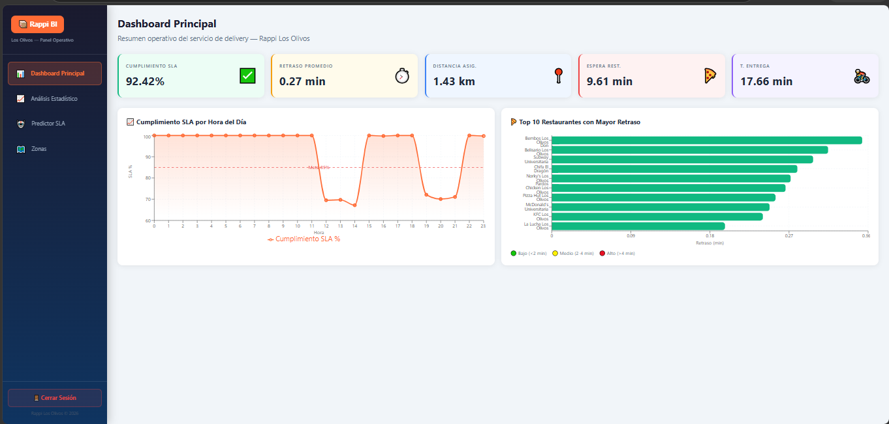

- Dashboard interactivo con datos en tiempo real desde MySQL
- **Predictor de SLA en tiempo real** usando el modelo XGBoost
- Indicador de API conectada en tiempo real

## 🤖 Modelo Predictivo

### 1. Regresión Lineal — Predicción de Tiempo de Entrega
- **Variable dependiente:** `tiempo_total_min`
- **Variables predictoras:** `dist_asignacion_km`, `tiempo_espera_rest_min`
- **R² = 0.83** → el modelo explica el 83% de la variabilidad

### 2. XGBoost — Clasificación de Cumplimiento SLA
- **Variable dependiente:** `cumple_sla` (binario: 1/0)
- **Precisión: 92.85%**
- Permite reasignación preventiva cuando P(SLA) < 60%

### 3. Isolation Forest — Detección de Anomalías
- Identifica pedidos con comportamiento inusual
- Anomalías concentradas en tiempos > 30 min

### 4. K-Means Clustering — Perfiles de Riesgo
- Agrupa pedidos por perfil operativo (bajo, medio, alto riesgo)
- Permite focalizar intervenciones por segmento

---

## 📐 KPIs Definidos

```
KPI 1 — Cumplimiento SLA
         (Pedidos a tiempo / Total pedidos) × 100

KPI 2 — Retraso Promedio
         Σ(tiempo_real - tiempo_SLA) / pedidos fuera de SLA

KPI 3 — Distancia Promedio de Asignación
         Σ dist_asignacion_km / total pedidos

KPI 4 — Espera Promedio en Restaurante
         Σ tiempo_espera_rest_min / total pedidos

KPI 5 — Tiempo Promedio de Entrega
         Σ tiempo_total_min / total pedidos
```

---

## 💡 Recomendaciones del Proyecto

- **Operativas:** Implementar pre-alertas 15 min antes a restaurantes de alta saturación → reducción estimada de 2-3 min por pedido
- **Tácticas:** Aumentar flota en 30% exclusivamente en franjas 12:00–14:00h y 19:00–21:00h para recuperar SLA > 85%
- **Tecnológicas:** Desplegar modelo via API REST en FastAPI con re-entrenamiento mensual incluyendo variables de tráfico y clima

---

## 👥 Equipo

| Integrante | Rol |
|---|---|
| Gutierrez Guerra, Renzo Manuel | Análisis de datos |
| Murillo Molina, Axl Antonio | ETL y modelado |
| Córdova Olivos, Samanta Milagros | Visualización BI |
| Sanchez Rosales, Jefferson Alexander | Machine Learning |
| Macalopú Torres, César Alexander | Backend y Frontend |
| Carhuaricra Cachi, Frank Steven | Documentación |

---

## 📚 Referencias

- Flores Cortez, R. A., & Manrique Añazco, J. O. (2019). *Datamart para proceso de armado de pedidos en la empresa Yobel SCM Logistics S.A.* Universidad César Vallejo.
- Giron, M. (2025). *Inteligencia de negocios para mejorar la toma de decisiones en el proceso logístico.* Universidad Continental.
- Zelada Flórez, E. A. (2022). *Gestión logística y atención al cliente en una empresa industrial del rubro alimentos.* Revista Economía & Negocios, 4(2), 57-79.

---
